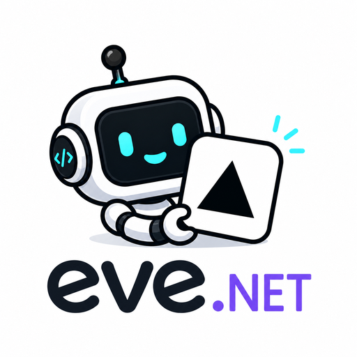

# NexusLabs.Eve

{ width="320" }

`NexusLabs.Eve` is a .NET client for the stable HTTP protocol exposed by
[Vercel eve](https://github.com/vercel/eve).

It provides:

- Health and agent inspection.
- Bearer, Basic, and Vercel OIDC authentication.
- Durable session continuation and persistence.
- NDJSON event streaming with reconnect-by-index.
- Cooperative turn cancellation.
- Attachments, human-input responses, and structured output.

The package is intentionally transport-focused. JavaScript UI helpers from
`eve/client`, such as React/Vue/Svelte integrations and `EveAgentStore`, are not
part of the .NET API.

## Compatibility

This release requires eve `0.31.0` or newer and targets eve `0.41.0`. eve `0.31.0`
moved session control operations to identifier-addressed routes and removed
continuation tokens from the client protocol, so an eve `0.29.x` or `0.30.x` agent is
not supported. Pin `0.1.0-alpha.3` for those. A mismatched client and agent accept the
first turn and fail the second, so verify a multi-turn conversation when changing
either side. See [Compatibility](compatibility.md) and [Migration](migration.md).

## Start here

Continue with [Getting Started](getting-started.md), then read
[Sessions](sessions.md) and [Streaming](streaming.md).
